# Memo: Does Daylight Saving Time Drive Crime? Evidence from NIBRS County Panels

**To:** Director of Research, state Office of Justice Programs  
**From:** Criminal justice data analysis team  
**Re:** DST and crime — NIBRS county panel, CA/FL/UT vs. AZ  
**Date:** April 2026  

**Stakeholder:** The target reader is a Director of Research at a state Office of Justice Programs — a senior policy analyst with graduate-level training in social science research methods, comfortable reading regression tables and understanding concepts like fixed effects and parallel trends, but not a specialist in econometrics. They advise legislators on public safety proposals and need results framed in terms of what action the evidence supports, not just what the model estimates.

---

## Executive Summary

Every spring, clocks spring forward one hour, and the perennial debate follows: does Daylight Saving Time increase crime? The intuition is that shifting ambient light changes when people are outside and vulnerable. The problem is that **DST months are summer months** — crime rises in summer for many reasons unrelated to the clock, and nearly every published seasonal comparison confounds the two. This memo addresses a specific, answerable version of the question: relative to Arizona — a state that does not observe DST — do California, Florida, and Utah show higher crime during the DST window after controlling for shared seasonal patterns?

We analyze a **county-day panel** for those four states using **three years of NIBRS data (2022–2024)** and **two-way fixed effects** with county and year-month fixed effects. We test six offense types and apply a **Holm-Bonferroni family-wise error rate correction** to account for testing multiple outcomes simultaneously.

**The headline finding is null: no offense type shows a statistically credible association with the DST window after correcting for multiple testing.** Unadjusted p-values for robbery (0.053) and theft from motor vehicle (0.064) were marginal, but after Holm-Bonferroni correction both rise to ~0.32. The all-crime aggregate is also null (β = +0.013, p = 0.600). There is one credible signal worth flagging for follow-up: **theft from motor vehicle in California and Utah individually** shows significant associations (CA p = 0.003, UT p = 0.004) that do not arise in Florida. This state-level heterogeneity is specific and consistent, but does not establish causality.

**Recommended action:** Do not cite this evidence in support of or against DST policy changes. The correct message is that current data provide no reliable basis for a DST-crime claim in aggregate. The CA/UT theft-from-motor-vehicle finding is worth commissioning a targeted follow-up study before drawing any policy conclusions.

## Decisions Requested

1. **Messaging.** The evidence supports confidently stating there is no demonstrated DST crime effect overall. Do not use the unadjusted marginal p-values for robbery or theft from motor vehicle in public briefings — they do not survive multiple-testing correction.

2. **The CA/UT theft-from-MV finding.** This is the one result that holds up to scrutiny at the state level. A decision is needed on whether to commission a targeted follow-up (multi-year hourly analysis for those two states) before this gets cited in any policy context.

3. **Scope of claims.** This analysis captures months-long DST-window exposure versus Arizona — not just the spring-forward weekend. Any legislative briefing should be explicit about that distinction: "DST season crime is no higher than in a non-DST comparison state" is the defensible claim, not "the spring-forward weekend has no effect."

## Why Arizona and Why Fixed Effects

The fundamental challenge is separating the clock from the calendar. **Figure 1** illustrates the problem: both California and Arizona show similar summer crime rises, even though Arizona does not observe DST. A simple "DST months vs. winter" comparison in California would appear to show a DST effect — but Arizona, with no clock change, shows the same seasonal pattern. This means the summer rise is driven by season, not the clock.

Arizona provides a rare within-U.S. benchmark: most of its counties do not observe DST, while sharing regional characteristics with parts of California and Utah. By absorbing county fixed effects (each county's average crime level) and year-month fixed effects (national or regional seasonal shocks shared across all states in a given month), the two-way fixed-effects design isolates differential exposure to the DST window specifically. Three Arizona counties in Navajo Nation territory do observe DST and are excluded from the control group.

**Figure 1 — Monthly seasonality and ±15-day spring-forward window (CA vs. AZ)**
*Both states show a similar summer crime rise, demonstrating why raw seasonal comparisons overstate any DST effect. The ±15-day panel shows average daily rates centered on each year's spring-forward date (day 0); no sharp jump at day 0 argues against a large one-day clock-change shock.*

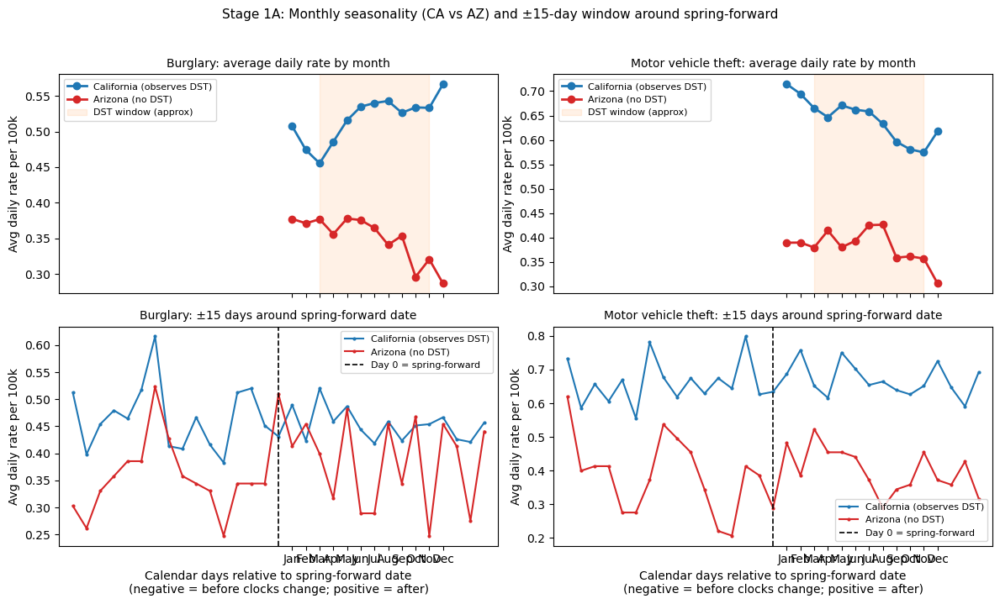

## What the Evidence Shows

### Pooled TWFE: null across all offense types

**Figure 2 — Baseline TWFE: DST-window effect on daily crime rates (CA, FL, UT vs. AZ)**
*All confidence intervals cross zero. After Holm-Bonferroni correction for testing six outcomes, no offense reaches significance.*

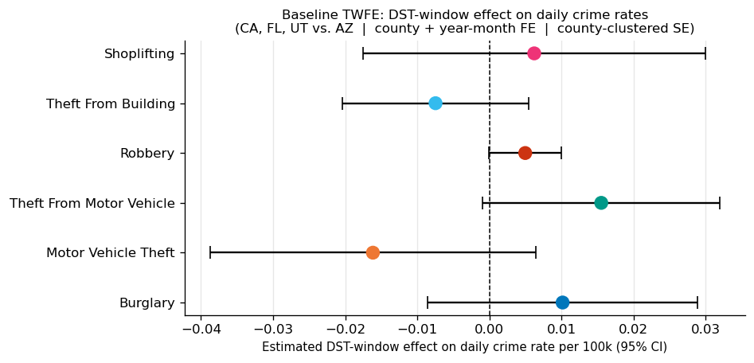

| Offense | Estimated effect | Unadjusted p | Holm-corrected p |
|---|---|---|---|
| Robbery | +0.005 per 100k/day | 0.053 | 0.320 |
| Theft from motor vehicle | +0.016 per 100k/day | 0.064 | 0.321 |
| Motor vehicle theft | −0.016 per 100k/day | 0.161 | 0.645 |
| Theft from building | −0.008 per 100k/day | 0.255 | 0.766 |
| Burglary | +0.010 per 100k/day | 0.287 | 0.766 |
| Shoplifting | +0.006 per 100k/day | 0.607 | 0.766 |

With six outcomes tested simultaneously, a false positive at the 10% level is expected roughly once by chance alone. Holm-Bonferroni controls the family-wise error rate — the probability that *any* result is a false positive. After correction, the two marginal estimates resolve to p ≈ 0.32, well above any conventional threshold.

### All-crime aggregate confirms the null

**Figure 3 — All-crime aggregate TWFE (sum of all six offense rates per county-day)**
*The aggregate effect is β = +0.013 per 100k/day (p = 0.600). Both the trend lines and the single point estimate confirm no detectable DST-window shift in total crime.*

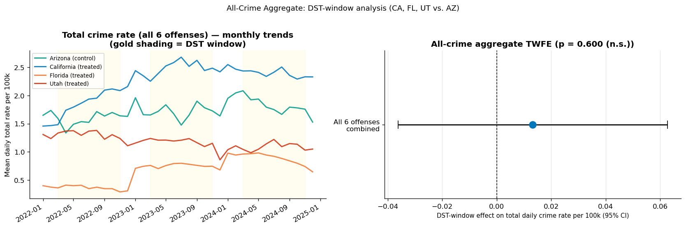

### The one credible signal: theft from motor vehicle in CA and UT

**Figure 4 — Heterogeneity by state (theft from motor vehicle)**
*CA vs AZ: β = +0.039, p = 0.003. UT vs AZ: β = +0.045, p = 0.004. Florida does not show the same pattern (p = 0.209). The two states with the tightest geographic match to Arizona — Utah, which borders it directly, and California — independently produce the same finding.*

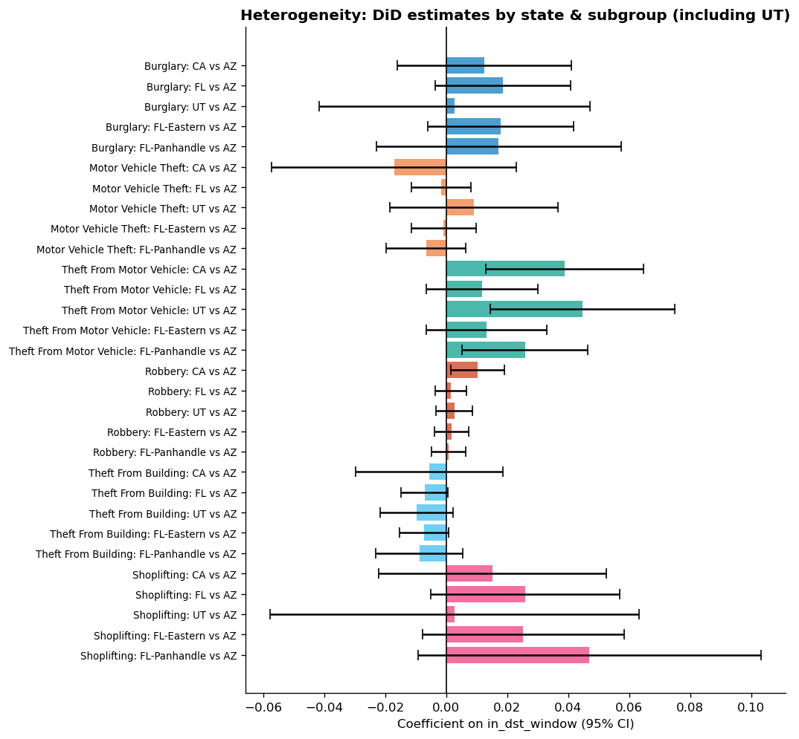

This state-level pattern is specific, directionally consistent across two independent comparisons, and at p-values that are strong even before correction. It does not automatically survive a full FWER correction across all outcomes and states simultaneously, and it does not establish that DST *causes* higher vehicle theft — pre-existing state-level trends cannot be fully excluded. But it is the most credible individual finding in the analysis and the appropriate focus of any follow-up work.

### Parallel trends hold for most offenses

**Figure 5 — Event studies around spring-forward (2-week bins)**
*Coefficients in the pre-period (bins −4 to −1) are close to zero for robbery, theft from motor vehicle, and motor vehicle theft — supporting parallel trends for those offenses. Burglary, shoplifting, and theft from building show borderline pre-trend violations; causal claims for those three offenses are not warranted here.*

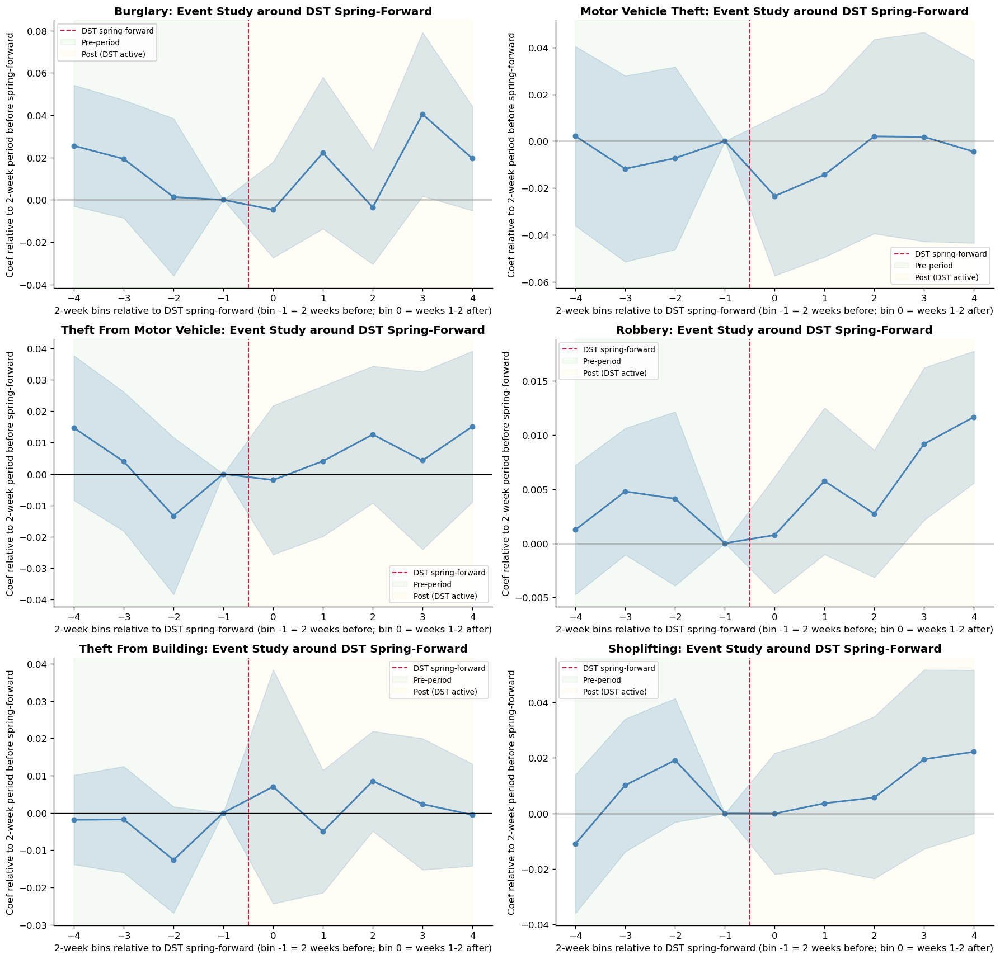

### The light-shift mechanism: not confirmed

As a diagnostic, we examined hourly crime profiles around spring-forward in California and Florida versus Arizona. If DST shifts crime through ambient light, the 24-hour profile should rotate: fewer crimes in the newly-lit evening hours, more in the newly-dark morning hours. The raw treated-state profile shows a 10–14% evening decline at hours 18–19 after spring-forward. However, Arizona shows a similar 7% evening decline over the same window despite no clock change — suggesting seasonality, not the clock, is driving the pattern.

The triple-difference regression — which tests whether the within-day shift in treated states is *differential* vs. Arizona — is **not statistically significant** (evening p = 0.74; morning p = 0.75). The morning coefficient is also negative, the opposite of what displacement predicts. **The light-shift mechanism is not confirmed in this one-year hourly sample.**

**Figure 6 — Hourly profiles, time-bucket summary, and triple-difference coefficients**
*Left: raw hourly profiles. Center: time-bucket means with 95% CI. Right: triple-difference coefficients — the direct DST mechanism test. Neither bucket is significant; the morning coefficient is in the wrong direction for the displacement hypothesis.*

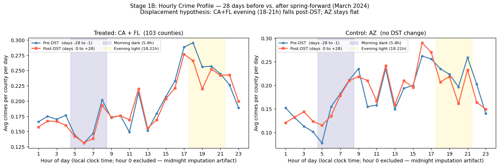

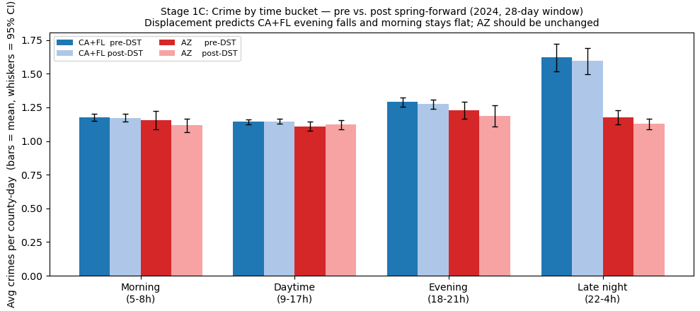

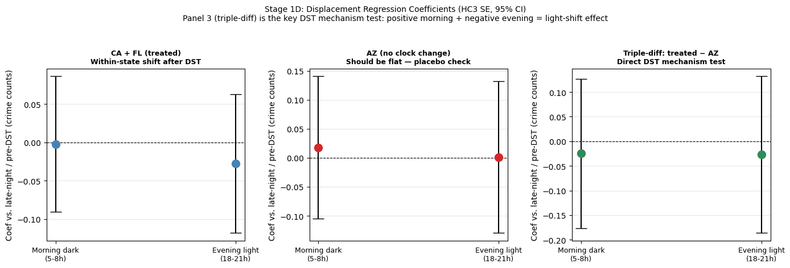

## Limitations

- **Multiple testing** is the binding constraint on all individual-offense claims. After FWER correction, nothing is significant in the pooled analysis. The CA/UT heterogeneity finding is the most credible result but does not survive correction across all outcomes and state subgroups simultaneously.
- **Arizona contributes only 12 control counties** against 154 treated counties. The small control group limits precision throughout.
- **NIBRS coverage varies** — Florida has thin participation in early years. Estimates that shift materially when thin-coverage years are dropped would not be reliable.
- **Burglary, shoplifting, and theft from building** show borderline pre-trend violations in the event studies; causal interpretation of those offenses is not supported here.

## Conclusion

Using Arizona as a no-DST benchmark and two-way fixed effects to remove shared seasonality, this analysis finds **no statistically credible evidence of a universal DST crime effect** across six offense types or in aggregate. The "Jelly Bean" problem — finding something marginally significant when testing many outcomes — is real here: after Holm-Bonferroni correction, the two marginally suggestive results (robbery and theft from motor vehicle in the pooled model) resolve to p ≈ 0.32.

The one finding that stands apart is **theft from motor vehicle in California and Utah**, each of which shows a significant association with the DST window independently (p < 0.004). This is worth investigating further, but it is not sufficient grounds for policy action on its own.

The appropriate conclusion for legislators is: **current evidence does not support citing crime as a basis for DST policy decisions in either direction.** A pre-registered multi-year hourly study focusing on CA and UT vehicle theft is the highest-value next step before this evidence base is used in a policy context.

## Appendix: Additional Figures

### Descriptive statistics

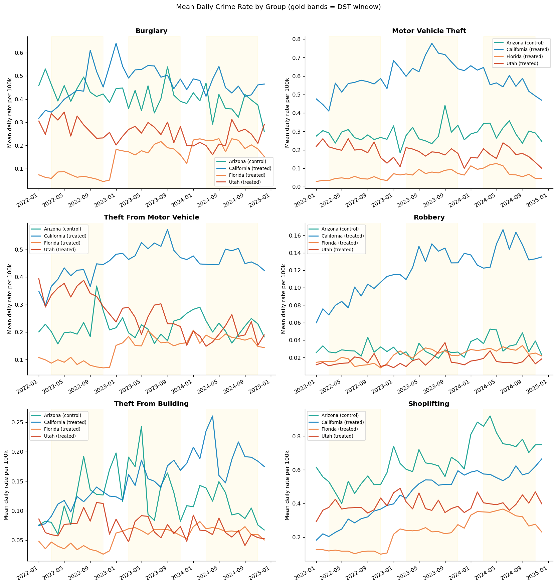

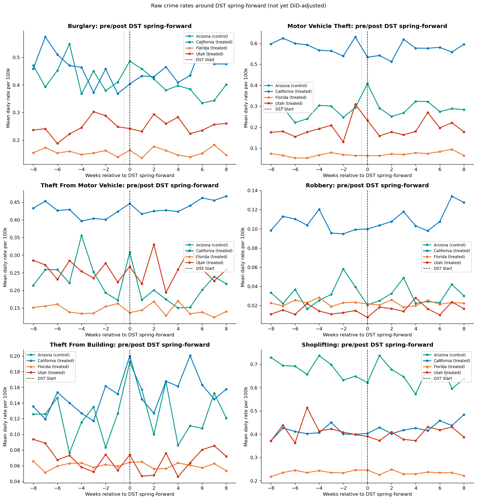

### Event study: fall-back

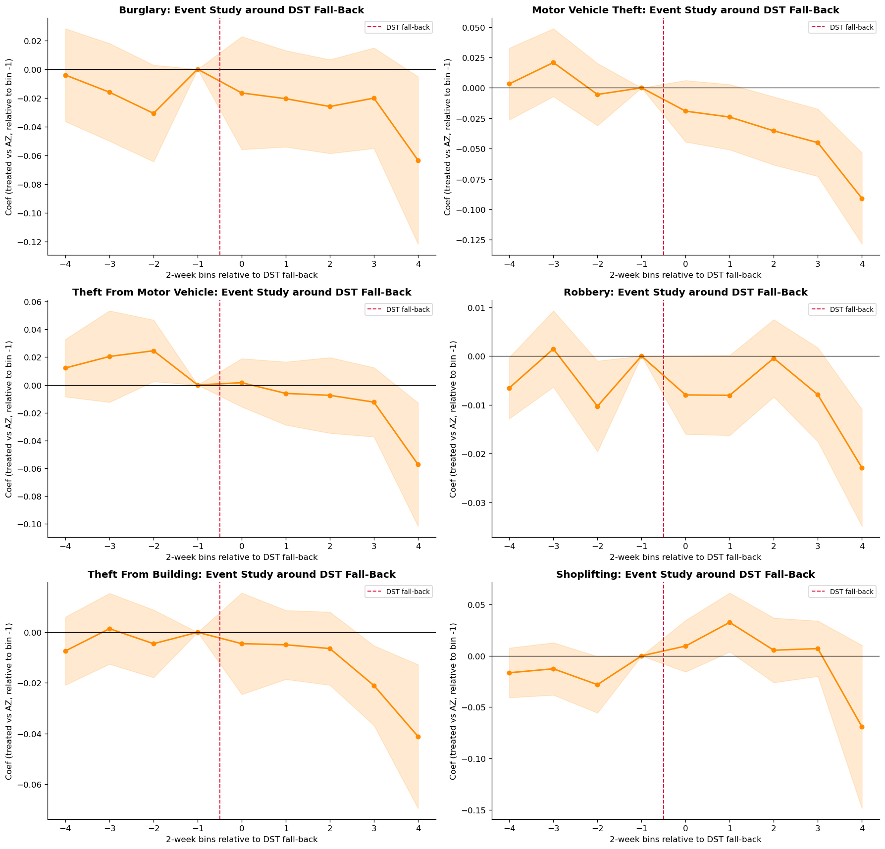

### Robustness checks

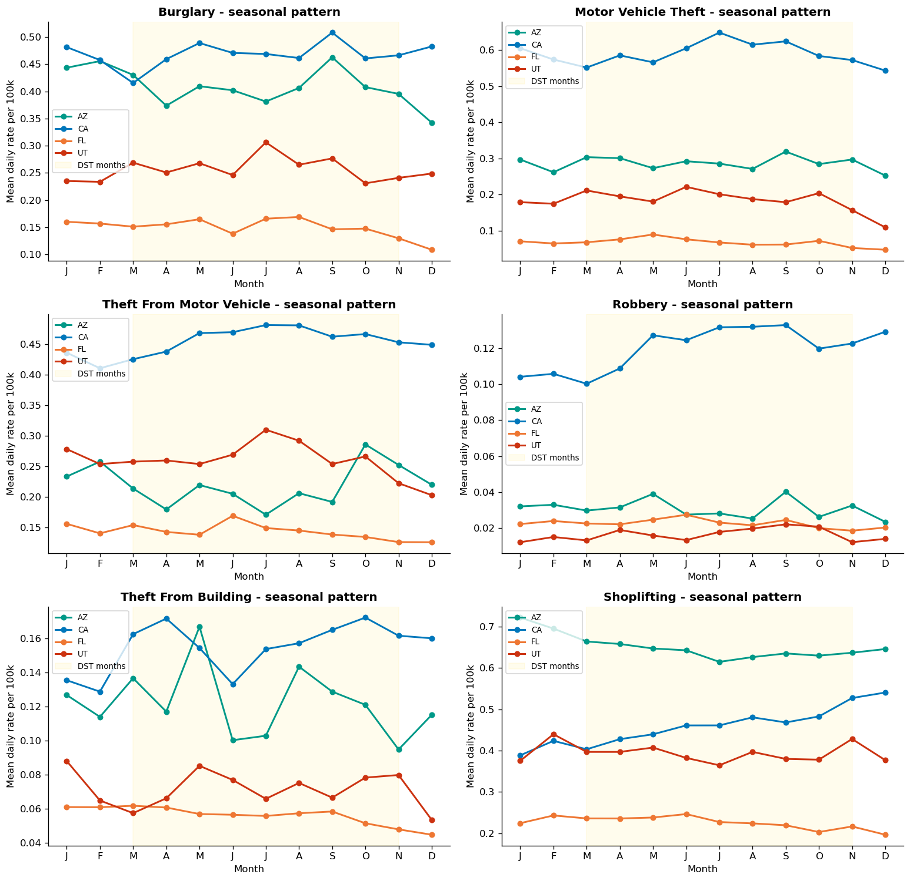
